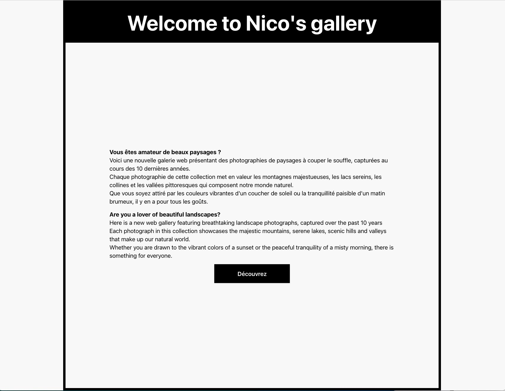
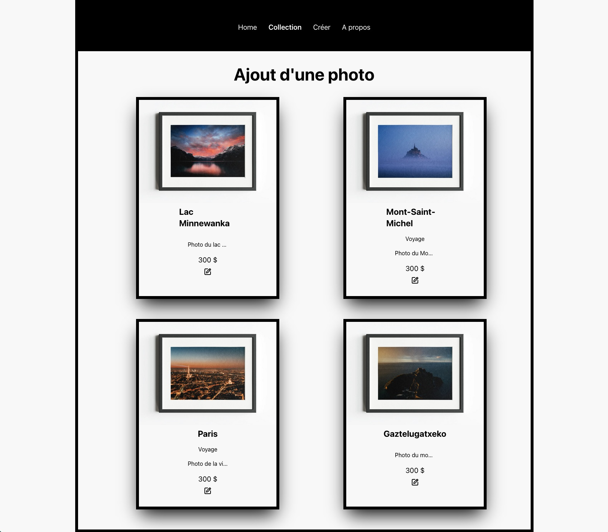
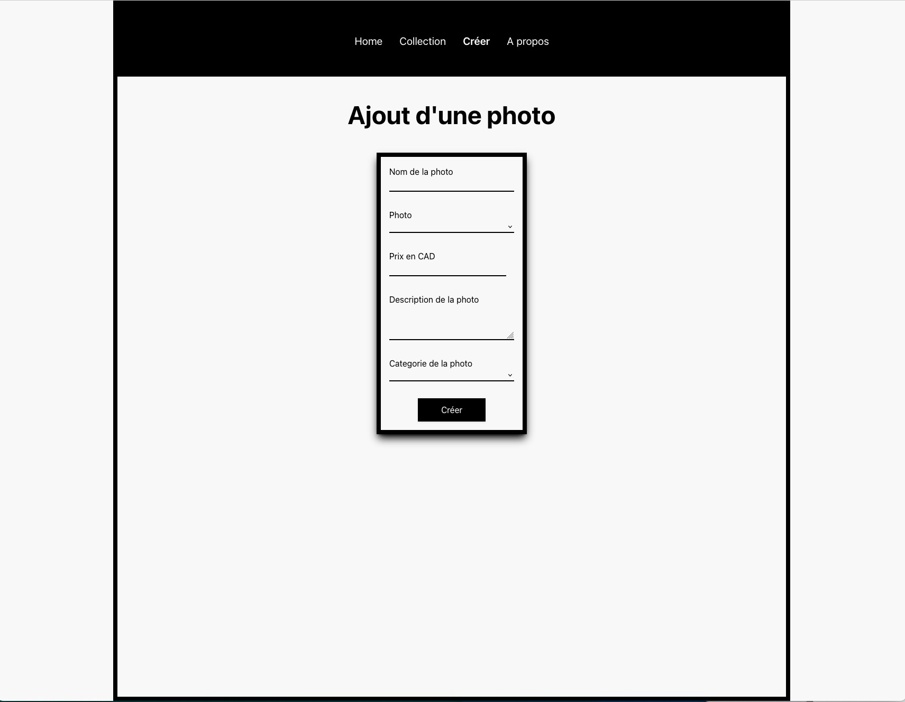

# TP Single page application avec Vue.js

Pour ce projet, il nous est demandé de créer une single page application avec Vue.Js

## Contraintes

-   Créer un server Node.JS
-   Créer une base de donnée MYSQL
-   Créer un projet Vue.JS CLI
-   Créer des pages (accueil, produit)
-   Créer une navigation entre les pages
-   La navigation doit se faire sans rafraichissement de la page (Site doit être monopage SPA)
-   Avoir la possibilité de d'ajouter, modifier et supprimer un produit
-   Faire une conception CSS (Tailwind CSS)

### Autres

Pour ce projet, j'ai décidé de créer un site web de vente de mes photographies.
Elles sont visibles ici 👉🏻 nicolasgodineau.com

# TP Single page application with Vue.js

For this project, we are asked to create a single page application with Vue.Js

## Constraints

-   Create a Node.JS server
-   Create a MYSQL database
-   Create a Vue.JS CLI project
-   Create pages (home, product)
-   Create navigation between pages
-   Navigation must be done without refreshing the page (Site must be single-page SPA)
-   Have the ability to add, modify and delete a product
-   Make a CSS design (Tailwind CSS)

### Others

For this project, I decided to create a website selling my photographs.
They can be seen here 👉🏻 nicolasgodineau.com

